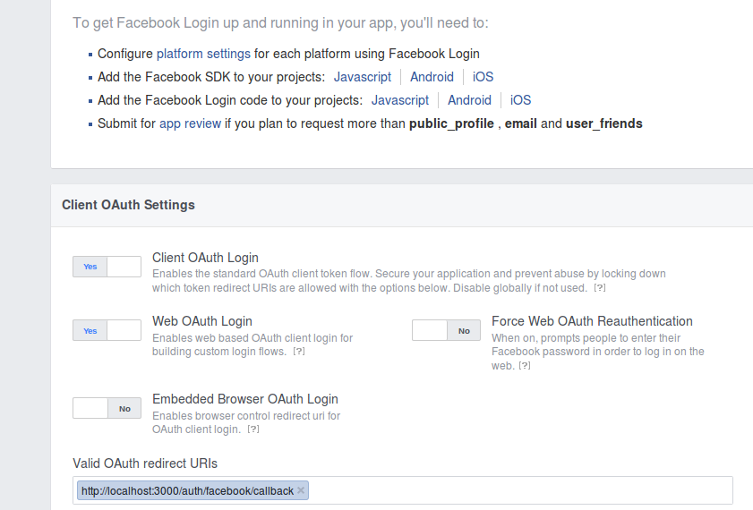
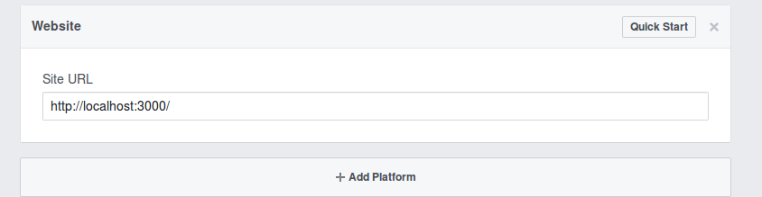
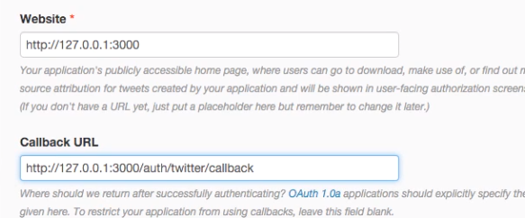

# facebook-twitter-authentication-express
Facebook, Twitter authentication in Express, remote db and distiquish between production and development environment.


### How to run this project:

First create your app in the [Facebook Developer Platform](http://developers.facebook.com)
 - make sure you add valid auth redirect callback, like so (Facebook Login tab)
 
 - make sure you add platform with your domain address, in development as (Settings/Basic tab):
 

Copy clientID and clientSecret from Dashboard Tab and paste to your ```development.json``` (make sure this file is in .gitingore)

Second create your app in [Twitter Developer Platform](https://apps.twitter.com)
- the process is exactly the same as Facebook, the only difference is that you can't use localhost as valid url, replace localhost as on th picture below:



Copy consumerKey and consumerSecret from KEys and Access Token Tab and paste to your ```development.json```

Create new json file called ```development.json``` in ```config``` folder and paste this code below:

```json
{
	"host": "http://localhost:3000",
	"dbURI": "mongodb://<dbuser>:<dbuserpassword>@ds888888.mlab.com:99999/someNameOfYourDatabase",
	"sessionSecret": "catscanfly",
	"fb": {
		"clientID": "<Facebook client id>",
		"clientSecret": "<Facebook client secret>",
		"callbackURL": "//localhost:3000/auth/facebook/callback",
		"profileFields": ["id", "displayName", "photos"]
	},
	"twitter": {
		"consumerKey": "<Twitter key>",
		"consumerSecret": "<Twitter secret>",
		"callbackURL": "//localhost:3000/auth/twitter/callback",
		"profileFields": ["id", "displayName", "photos"]
	}
}

```

Replace relevant information : keys from Facebook and Twitter.


Third step - create remote database in [mongolab](https://mlab.com/).
- crate new database
- pick amazon services
- check sanbox free
- named your database

Then add database. Copy the url which look like this:

```
mongodb://<dbuser>:<dbuserpassword>@ds888888.mlab.com:99999/someNameOfYourDatabase
```

This url is located when you click on your new created database , just above the Collections table.

Run ```npm install```

Head over to : ```http://localhost:3000```

After successful athentication, check your database in mongolab for the new user entry.

### Reference:

- [passport-facebook](https://github.com/jaredhanson/passport-facebook)
